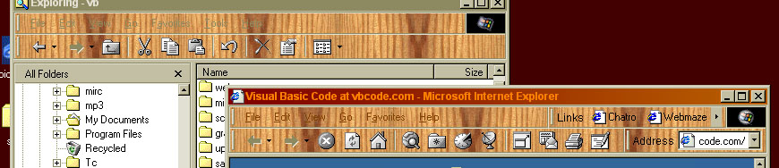



## Display skins in  IE/Explorer Toolbars

### Description

What this code does is allow you to chose a image and then display it as a 'skin' in Windows Explorer/Internet Explorer. Have a look at the screen shot; A picture says a thousand words, and nicely sums up what this program does. Please vote for me If you find it useful or interesting!
 
### More Info
 

             |
---                |---
**Submitted On**   |2000-07-05 22:58:54
**By**             |[Jamie Dillon](https://github.com/Planet-Source-Code/PSCIndex/blob/master/ByAuthor/jamie-dillon.md)
**Level**          |Intermediate
**User Rating**    |4.6 (23 globes from 5 users)
**Compatibility**  |VB 3\.0, VB 4\.0 \(16\-bit\), VB 4\.0 \(32\-bit\), VB 5\.0, VB 6\.0, VB Script, ASP \(Active Server Pages\) 
**Category**       |[Complete Applications](https://github.com/Planet-Source-Code/PSCIndex/blob/master/ByCategory/complete-applications__1-27.md)
**World**          |[Visual Basic](https://github.com/Planet-Source-Code/PSCIndex/blob/master/ByWorld/visual-basic.md)
**Archive File**   |[CODE\_UPLOAD7449752000\.zip](https://github.com/Planet-Source-Code/jamie-dillon-display-skins-in-ie-explorer-toolbars__1-9518/archive/master.zip)

